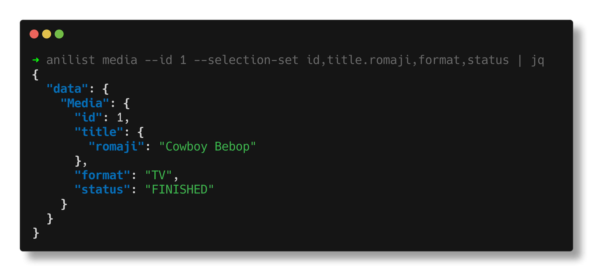

# 🍡 `anilist`

> Command-line client for the AniList GraphQL API

`anilist` is an OCaml command-line client for the AniList GraphQL API. It lowers concise CLI arguments into GraphQL operations and prints JSON responses.

<p align="center">
  
</p>

## Features

- Ergonomic lowering for common AniList queries
- Tree-shaped selection support with `--field` and `--selection-set`
- Variables, fragments, inline fragments, and multi-operation documents
- Schema introspection via `schema`, `schema --type`, and `schema --directive`
- Custom HTTP headers with repeated `--header`
- Docker runner for use without a local OCaml toolchain

## Build

```bash
dune build
```

## Install

Install the executable into your local opam prefix:

```bash
dune install --release
```

Then run:

```bash
anilist media --id 1 --selection-set id,title.romaji,format,status
```

## Docker

Build the image:

```bash
docker build -t fuwn/anilist .
```

Run a query:

```bash
docker run --rm fuwn/anilist media --id 1 --selection-set id,title.romaji,format,status
```

## Usage

Get an anime:

```bash
anilist media --id 1 --selection-set id,title.romaji,format,status
```

Inspect the schema:

```bash
anilist schema
anilist schema --type Media
anilist schema --directive include
```

Send an authorization header:

```bash
anilist --header 'Authorization: Bearer <token>' media --id 1 --selection-set id,title.romaji
```

Use variables explicitly:

```bash
anilist query \
  --variable-definition '$media_id: Int!' \
  --variable 'media_id=1' \
  --field media \
  --id var:media_id \
  --selection-set id,title.romaji,format,status
```

The endpoint defaults to `https://graphql.anilist.co`. Override it with `ANILIST_GRAPHQL_ENDPOINT`:

```bash
ANILIST_GRAPHQL_ENDPOINT='https://graphql.anilist.co' anilist media --id 1 --selection-set id,title.romaji
```

## License

Licensed under the GNU Affero General Public License v3.0 only. See [LICENSE](./LICENSE).
